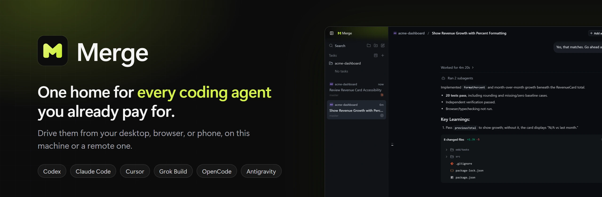
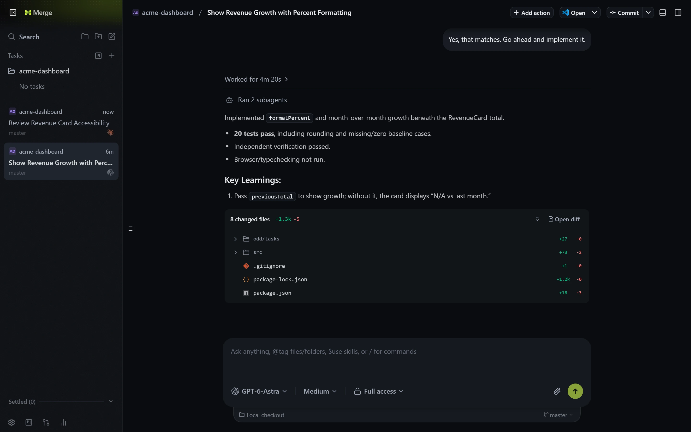
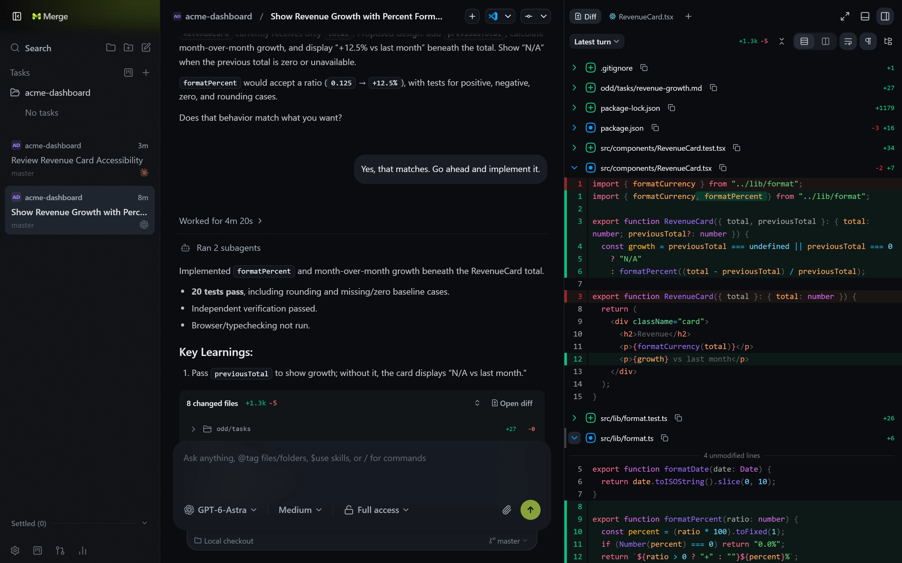
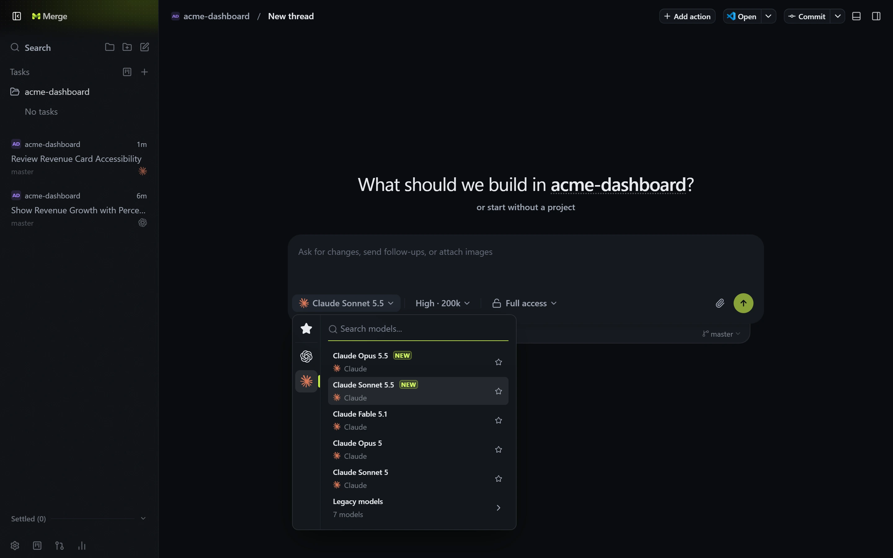
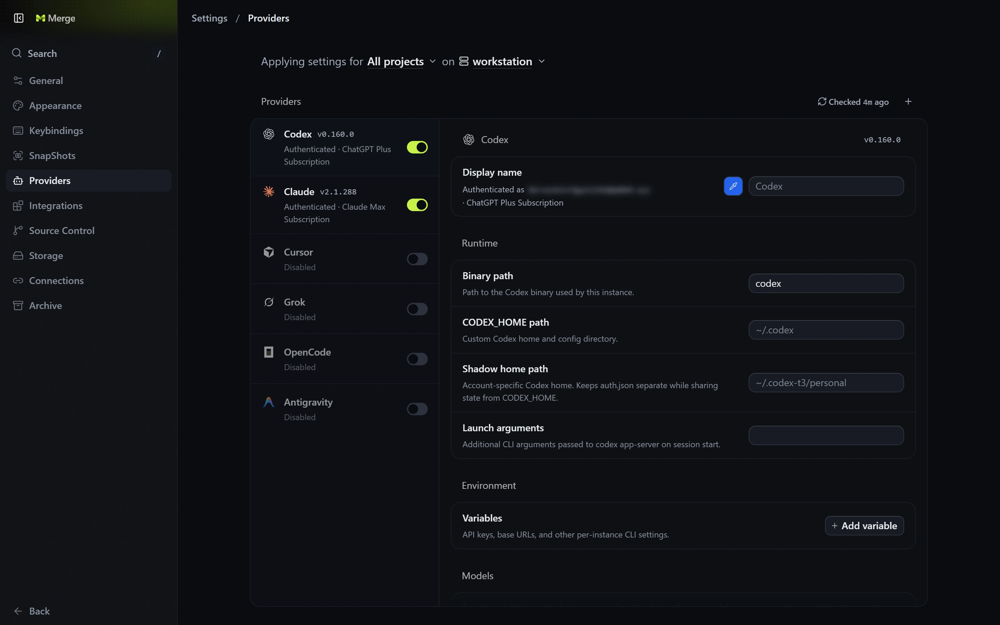

<p align="center">
  
</p>

# Merge

Merge is a desktop, web, and mobile control surface for the coding agents on your machine. It
works with your existing subscriptions to Claude Code, Codex, Cursor, Grok Build, OpenCode, and
Google Antigravity: if they are set up on your computer, Merge can drive them.

> [!NOTE]
> Merge is a fork of [T3 Code](https://github.com/pingdotgg/t3code) by T3 Tools, released under
> the MIT License. Most of the code is theirs; this fork rebrands it and ships its own builds.

## A quick look

Agents work in threads, grouped by project. Each turn ends with a summary of what changed.



Review every turn's diff next to the conversation, then commit from the same window.



Switch providers and models per thread. Codex and Claude threads sit side by side in the
sidebar.



Turn providers on or off, and point each at its own binary, home directory, and environment.



## Prerequisites

Install and authenticate at least one provider on the machine that will run the agents:

- Codex: install [Codex CLI](https://developers.openai.com/codex/cli) and run `codex login`
- Claude: install [Claude Code](https://claude.com/product/claude-code) and run `claude auth login`
- Cursor: install [Cursor CLI](https://cursor.com/cli) and run `agent login`
- Grok Build: install [Grok Build CLI](https://x.ai/cli) and run `grok login`
- OpenCode: install [OpenCode](https://opencode.ai) and run `opencode auth login`
- Antigravity: enable it in Settings, then use **Install Antigravity** and **Sign in with Google**. No CLI is required.

## Install

### Desktop app

Download the installer for your platform from
[GitHub Releases](https://github.com/jonathanfernandezfm/merge/releases):

| Platform       | File                                                      |
| -------------- | --------------------------------------------------------- |
| Windows        | `Merge-<version>-x64.exe` or `Merge-<version>-arm64.exe`  |
| macOS          | `Merge-<version>-arm64.dmg` (Apple Silicon) or `-x64.dmg` |
| Linux          | `Merge-<version>-<arch>.AppImage`                         |
| Debian, Ubuntu | `Merge-<version>-<arch>.deb`                              |

Release builds may be unsigned:

- **macOS:** if Gatekeeper refuses to open the app, right-click it and choose **Open**, or allow it
  in **System Settings → Privacy & Security**.
- **Windows:** if SmartScreen blocks the installer, choose **More info → Run anyway**.

### Command line (server only)

Use the `merge-agent` CLI on a machine without the desktop app, such as a remote host:

```bash
curl -fsSL https://raw.githubusercontent.com/jonathanfernandezfm/merge/main/scripts/install.sh | sh
```

On Windows, in PowerShell:

```powershell
irm https://raw.githubusercontent.com/jonathanfernandezfm/merge/main/scripts/install.ps1 | iex
```

Then:

| Task                                  | Command                       |
| ------------------------------------- | ----------------------------- |
| Start the server and open the web app | `merge-agent`                 |
| Start the server without a browser    | `merge-agent serve`           |
| Pair another device                   | `merge-agent pair`            |
| Run in the background (macOS, Linux)  | `merge-agent service install` |
| Update to a newer release             | `merge-agent update`          |
| Full reference                        | `merge-agent --help`          |

There is no CLI build for Intel Macs; see [Install Merge](./docs/user/install.md#intel-macs).

### Mobile app

The mobile app is not on the App Store or Google Play. Build it with your own Expo account; see
the [mobile README](./apps/mobile/README.md).

## Remote access

Merge connects clients directly to the machine running your agents. There is no hosted relay or
hosted web app.

- **LAN or private network:** `merge-agent serve --host <private-ip>`, then `merge-agent pair`.
- **Tailscale:** `merge-agent serve --tailscale-serve`, or `merge-agent pair --tailscale` on a
  running server.
- **SSH:** in the desktop app, **Settings → Connections → Add environment → SSH**.

Details: [Remote access](./docs/user/remote-access.md).

## Build from source

1. Install [Vite+](https://viteplus.dev/guide/), which provides the `vp` command:
   - macOS / Linux: `curl -fsSL https://vite.plus | bash`
   - Windows: `irm https://vite.plus/ps1 | iex`
2. Install dependencies: `vp i`
3. Start the server and web app: `vp run dev` (or `vp run dev:desktop` for the desktop app)

The [development runbook](./docs/operations/development.md) covers ports, test data, and
packaging.

## Documentation

- [Install and first run](./docs/user/install.md)
- [Remote access](./docs/user/remote-access.md)
- [Running in the background](./docs/user/background-service.md)
- [Updating Merge](./docs/user/updating.md)
- [All user guides](./docs/README.md)
- [Architecture overview](./docs/internals/overview.md)

## Contributing

Merge is early and expects bugs. Read [CONTRIBUTING.md](./CONTRIBUTING.md) before opening an issue
or PR. Report bugs in [issues](https://github.com/jonathanfernandezfm/merge/issues) and propose
ideas in [discussions](https://github.com/jonathanfernandezfm/merge/discussions).

## License

[MIT](./LICENSE). Based on [T3 Code](https://github.com/pingdotgg/t3code), copyright T3 Tools Inc.
